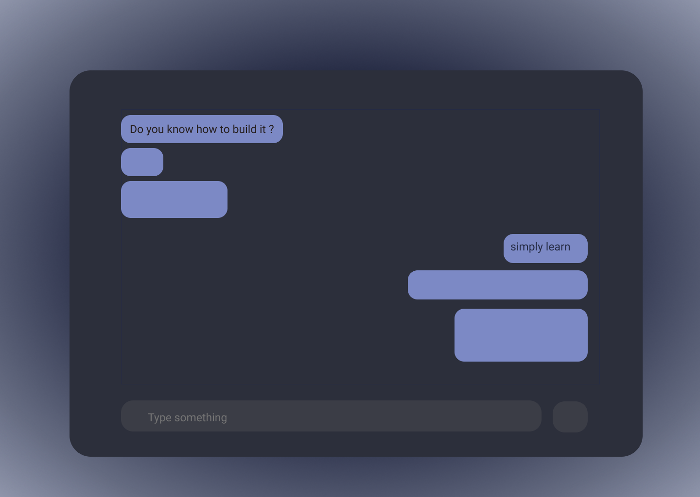
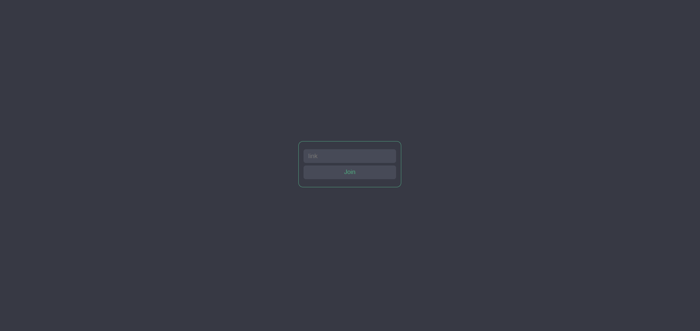
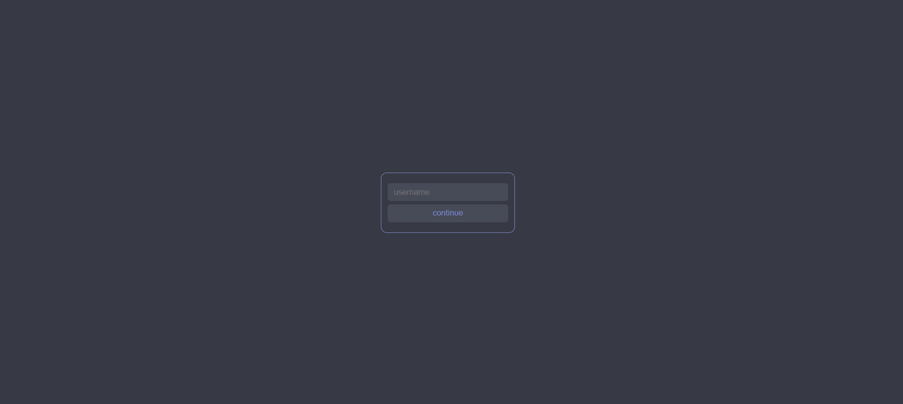
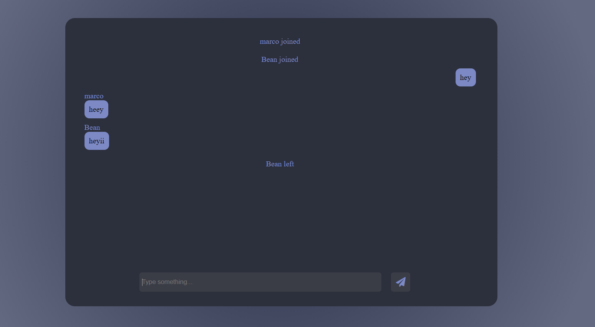

# chat-system

## Live Url

[Click Here](chat.abkap.me)

## demo image

## requirements

1.  nodejs
2.  npm package manager

## How To Run

1. install dependencies  
   `npm install`  
   This will install all the dependencies for this project
2. execute
   `node app.js`

**nodejs server will be hosted on _localhost:3000_**

## How it looks

