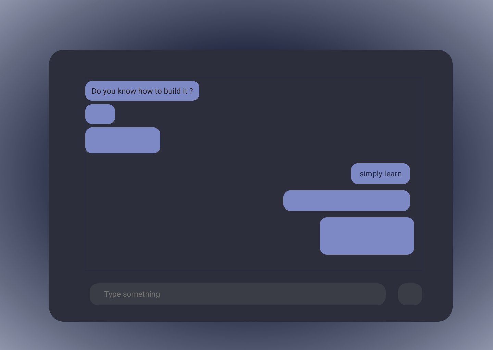

# chat-system

## demo image

## requirement

1.  nodejs
2.  npm package manager

## How To Run ? 

1. install dependencies  
   `npm install`
2. execute
   `node app.js`

**nodejs server will be hosted on _localhost:3000_**
